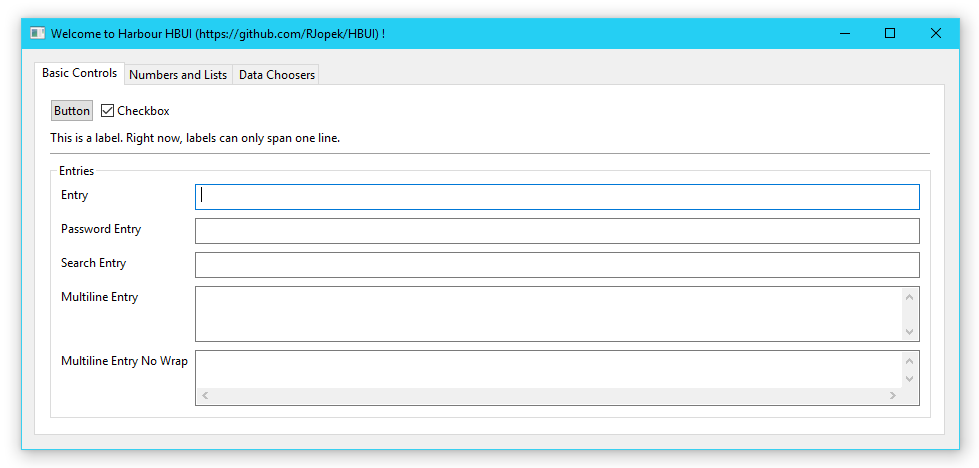
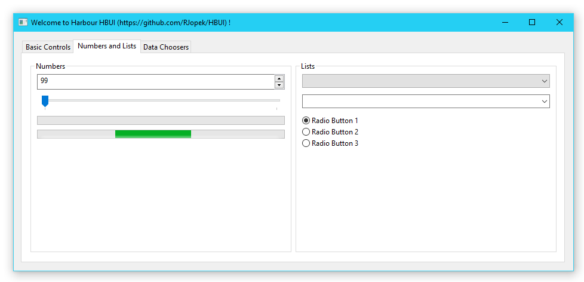
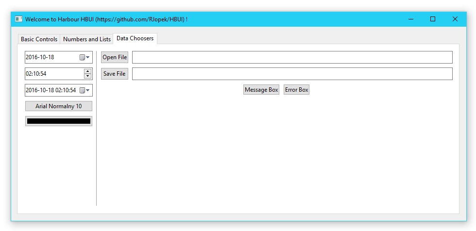
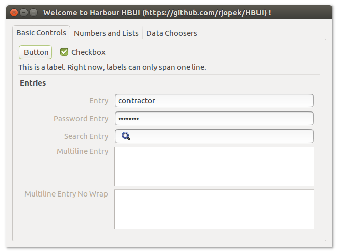
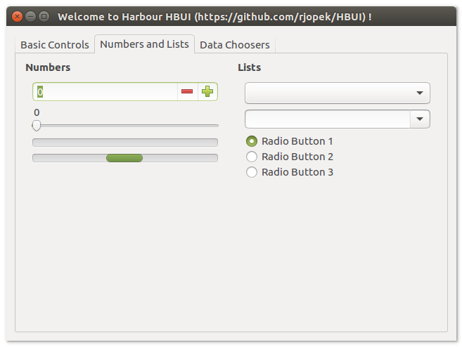
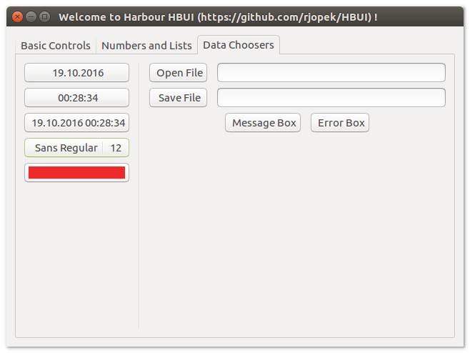

# **HBUI**

Graphical user interface library for the Harbour compiler, this is a wrapper library around [libui](https://github.com/andlabs/libui), a portable GUI library.

- Read more about the - [Cross platform](https://en.wikipedia.org/wiki/Cross-platform)
- Read more about the - [Harbour (software)](https://en.wikipedia.org/wiki/Harbour_(software))

### How to get
- first of all please download [Harbour](https://github.com/harbour/core)
- HBUI live source repository

You'll need Git version control software installed on your system, and issue this command:
```
$ git clone https://github.com/rjopek/hbui
```
You can get subsequent updates using this command:

```
$ git pull
```

### How to build
For all systems, use the command:
- [Read tutorial](https://github.com/rjopek/HBUI/blob/master/samples/README.md)
- (you must (i.e.) export HB_WITH_LIBUI="/the/path/to/libui")
-   ( Darwin: you must export where the LIBUI dynamic library is (i.e.): DYLD_LIBRARY_PATH="/the/path/to/libui/build/out" )  

```
$ hbmk2 hbui.hbp
```
To test it, type:
```
$ cd samples
$ hbmk2 window.prg -run
```

### Sample source code
```
FUNCTION Main()
  LOCAL oWindow

  oWindow := uiNewWindow( "main Window", 800, 600, .T. )

  ? "pointer:", oWindow

  uiControlShow( oWindow )

  uiMain()
  uiUninit()

RETURN NIL
```

### Screenshots










### License
---
MIT

**Free Software, Hell Yeah!** ;-)

###### All trademarks and company names are used for information purposes only.
