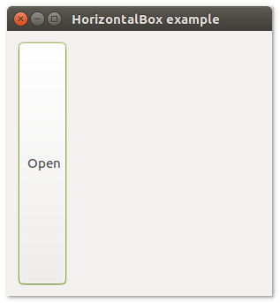

# **uiBox**

## Description

## Functions
- [uiNewHorizontalBox()](#uinewhorizontalbox)
- [uiNewVerticalBox()](#uinewverticalbox)
- [uiBoxAppend( uiBox, uiControl, stretchy )](#uiboxappend-uibox-uicontrol-stretchy)
- [uiBoxDelete( uiBox, index )](#uiboxdelete-uibox-index)
- [uiBoxPadded( uiBox )](#uiboxpadded-uibox)
- [uiBoxSetPadded( uiBox, padded )](#uiboxsetpadded-uibox-padded)

## uiNewHorizontalBox()
Arguments

Return value

Description

Simple example
```harbour
oHorizontalBox := uiNewHorizontalBox()
```
## uiNewVerticalBox()
Arguments

Return value

Description

Simple example
```harbour
oVerticalBox := uiNewVerticalBox()
```
## uiBoxAppend (uiBox, uiControl, stretchy)
Arguments
- uiBox
- uiControl
- stretchy

Return value

Description

Simple example
```harbour
uiBoxAppend( oHorizontalBox, uiControl( oTab ), .T. )
```
## uiBoxDelete (uiBox, index)
Arguments
- uiBox
- index

Return value

Description

Simple example
```harbour

```
## uiBoxPadded (uiBox)
Arguments
- uiBox

Return value

Description

Simple example
```harbour
uiBoxPadded( oHorizontalBox )
```
## uiBoxSetPadded (uiBox, padded)
Arguments
- uiBox
- padded

Return value

Description

Simple example
```harbour
uiBoxSetPadded ( oHorizontalBox, .T. )
```
## Sample source code
```harbour
FUNCTION Main()
  LOCAL error
  LOCAL oWindow
  LOCAL oButton
  LOCAL oHorizontalBox

  IF ! HB_ISNULL( error := uiInit() )
    Alert( "Failed to initializa libui... " + error )
    RETURN NIL
  ENDIF

  oWindow := uiNewWindow( "HorizontalBox example", 300, 300, .T. )
  uiWindowSetMargined( oWindow, 1 )

  oButton := uiNewButton( "Open" )

  oHorizontalBox := uiNewHorizontalBox()
  uiBoxSetPadded( oHorizontalBox, 1 )
  uiBoxAppend( oHorizontalBox, oButton, 0 )

  uiWindowSetChild( oWindow, oHorizontalBox )
  uiControlShow( oWindow )

  uiMain()
  uiUninit()

RETURN NIL
```

## Sample source code
```harbour
FUNCTION Main()
  LOCAL error
  LOCAL oWindow
  LOCAL oButton
  LOCAL oVerticalBox

  IF ! HB_ISNULL( error :=  uiInit() )
    Alert( "Failed to initializa libui... " + error )
    RETURN NIL
  ENDIF

  oWindow := uiNewWindow( "VerticalBox example", 300, 300, .T. )
  uiWindowSetMargined( oWindow, 1 )

  oButton := uiNewButton( "Open" )

  oVerticalBox := uiNewVerticalBox()
  uiBoxSetPadded( oVerticalBox, 1 )
  uiBoxAppend( oVerticalBox, oButton, 0 )

  uiWindowSetChild( oWindow, oVerticalBox )
  uiControlShow( oWindow )

  uiMain()
  uiUninit()

RETURN NIL
```

