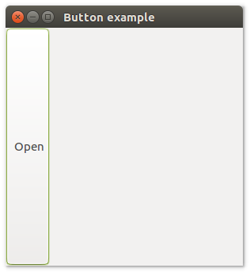
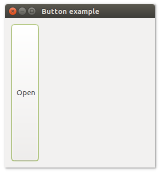
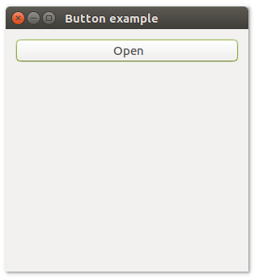
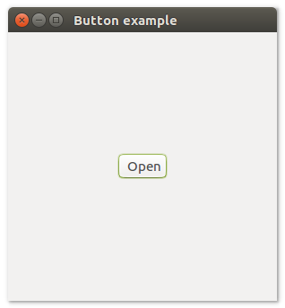

# **uiButton**

### Description
uiButton is a Control that represents a button that the user can click to perform an action. A Button has a text label that should describe what the button does.
uiButton allow users to perform an immediate action.

## Functions
- [uiNewButton( text )](#uinewbutton-text),
- [uiButtonOnClicked( uiButton, uiButton, data )](#uibuttononclicked-uibutton-uibutton-data)
- [uiButtonSetText( uiButton, text )](#uibuttonsettext-uibutton-text)
- [uiButtonText( uiButton )](#uibuttontext-uibutton)

## uiNewButton (text)
Arguments
- text

Return value

Description <br>
uiNewButton creates a new Button with the given text as its label.

Simple example
```harbour
oButton := uiNewButton( "Open" )
```
## uiButtonOnClicked (uiButton, uiButton, data)
Arguments
- uiButton
- uiButton
- data

Return value

Description

Simple example
```harbour

```
## uiButtonSetText (uiButton, text)
Arguments
- uiButton
- text

Return value

Description

Simple example
```harbour
uiButtonSetText( oButton, "New Open " )
```
## uiButtonText (uiButton)
Arguments
- uiButton

Return value

Description

Simple example
```harbour
uiButtonText( oButton )
```
## Sample source code
```harbour
FUNCTION Main()
  LOCAL error
  LOCAL oWindow
  LOCAL oButton

  IF ! HB_ISNULL( error := uiInit() )
    Alert( "Failed to initialize libui... " + error )
    RETURN NIL
  ENDIF

  oWindow := uiNewWindow( "Button example", 300, 300, .T. )
  uiWindowSetMargined( oWindow, 1 )

  oButton := uiNewButton( "Open" )

  uiWindowSetChild( oWindow, oButton )
  uiControlShow( oWindow )

  uiMain()
  uiUninit()

RETURN NIL
```

## Sample source code
```harbour
FUNCTION Main()
  LOCAL error
  LOCAL oWindow
  LOCAL oButton
  LOCAL oHorizontalBox

  IF ! HB_ISNULL( error := uiInit() )
    Alert( "Failed to initialize libui... " + error )
    RETURN NIL
  ENDIF

  oWindow := uiNewWindow( "Button example", 300, 300, .T. )
  uiWindowSetMargined( oWindow, 1 )

  oButton := uiNewButton( "Open" )

  oHorizontalBox := uiNewHorizontalBox()
  uiBoxSetPadded( oHorizontalBox, 1 )
  uiBoxAppend( oHorizontalBox, oButton, 0 )

  uiWindowSetChild( oWindow, oHorizontalBox )
  uiControlShow( oWindow )

  uiMain()
  uiUninit()

RETURN NIL
```

## Sample source code
```harbour
FUNCTION Main()
  LOCAL error
  LOCAL oWindow
  LOCAL oButton
  LOCAL oVerticalBox

  IF ! HB_ISNULL( error := uiInit() )
    Alert( "Failed to initialize libui... " + error )
    RETURN NIL
  ENDIF

  oWindow := uiNewWindow( "Button example", 300, 300, .T. )
  uiWindowSetMargined( oWindow, 1 )

  oButton := uiNewButton( "Open" )

  oVerticalBox := uiNewVerticalBox()
  uiBoxSetPadded( oVerticalBox, 1 )
  uiBoxAppend( oVerticalBox, oButton, 0 )

  uiWindowSetChild( oWindow, oVerticalBox )
  uiControlShow( oWindow )

  uiMain()
  uiUninit()

RETURN NIL
```

## Sample source code
```harbour
#include "hbui.ch"

FUNCTION Main()
  LOCAL error
  LOCAL oWindow
  LOCAL oButton
  LOCAL oGrid

  IF ! HB_ISNULL( error := uiInit() )
    Alert( "Failed to initialize libui... " + error )
    RETURN NIL
  ENDIF

  oWindow := uiNewWindow( "Button example", 300, 300, .T. )
  uiWindowSetMargined( oWindow, 1 )

  oButton := uiNewButton( "Open" )

  oGrid := uiNewGrid()
  uiGridSetPadded( oGrid, 1 )
  uiGridAppend( oGrid, oButton, 0, 0, 1, 1, 1, uiAlignCenter, 1, uiAlignCenter )
	
  uiWindowSetChild( oWindow, oGrid )
  uiControlShow( oWindow )

  uiMain()
  uiUninit()

RETURN NIL
```
