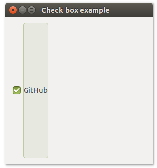
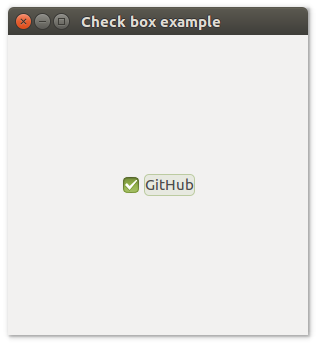

# **uiCheckbox**
---

### Description

---
### Functions

- [uiNewCheckbox( text )](#uinewcheckbox-text)
- [uiCheckboxChecked( uiCheckbox )](#uicheckboxchecked-uicheckbox)
- [uiCheckboxOnToggled( uiCheckbox, uiCheckbox, data )](#uicheckboxontoggled-uicheckbox-uicheckbox-data)
- [uiCheckboxSetChecked( uiCheckbox, checked )](#uicheckboxsetchecked-uicheckbox-checked)
- [uiCheckboxSetText( uiCheckbox, text )](#uicheckboxsettext-uicheckbox-text)
- [uiCheckboxText( uiCheckbox )](#uicheckboxtext-uicheckbox)

---
#### uiNewCheckbox (text)
Arguments
- text

Return value

Description

Simple example
```harbour
oCheckbox := uiNewCheckbox( "GitHub" )
```
---
#### uiCheckboxChecked (uiCheckbox)
Arguments
- uiCheckbox

Return value

Description

Simple example
```harbour
uiCheckboxChecked( oCheckbox )
```
---
#### uiCheckboxOnToggled (uiCheckbox, uiCheckbox, data)
Arguments
- uiCheckbox
- uiCheckbox
- data

Return value

Description

Simple example
```harbour
uiCheckboxOnToggled( uiCheckbox, toggleSpaced, NULL )
```
---
#### uiCheckboxSetChecked (uiCheckbox, checked)
Arguments
- uiCheckbox
- checked

Return value

Description

Simple example
```harbour
uiCheckboxSetChecked( oCheckbox, 1 )
```
---
#### uiCheckboxSetText (uiCheckbox, text)
Arguments
- uiCheckbox
- text

Return value

Description

Simple example
```harbour
uiCheckboxSetText( oCheckbox, "it's free" )
```
---
#### uiCheckboxText (uiCheckbox)
Arguments
- uiCheckbox

Return value

Description

Simple example
```harbour
uiCheckboxText( oCheckbox )
```
---
### Sample source code
```harbour
FUNCTION Main()
  LOCAL error
  LOCAL oWindow
  LOCAL oCheckbox

  IF ! HB_ISNULL( error := uiInit() )
    Alert( "Failed to initialize libui... " + error )
    RETURN NIL
  ENDIF

  oWindow := uiNewWindow( "Check box example", 300, 300, .T. )
  uiWindowSetMargined( oWindow, 1 )

  oCheckbox := uiNewCheckbox( "GitHub" )
  uiCheckboxSetChecked( oCheckbox, 1 )

  uiWindowSetChild( oWindow, oCheckbox )
  uiControlShow( oWindow )

  uiMain()
  uiUninit()

RETURN NIL
```

```harbour
#include "hbui.ch"

FUNCTION Main()
  LOCAL error
  LOCAL oWindow
  LOCAL oCheckbox
  LOCAL oGrid

  IF ! HB_ISNULL( error := uiInit() )
    Alert( "Failed to initialize libui... " + error )
    RETURN NIL
  ENDIF

  oWindow := uiNewWindow( "Check box example", 300, 300, .T. )
  uiWindowSetMargined( oWindow, 1 )

  oCheckbox := uiNewCheckbox( "GitHub" )
  uiCheckboxSetChecked( oCheckbox, 1 )

  oGrid := uiNewGrid()
  uiGridSetPadded( oGrid, 1 )
  uiGridAppend( oGrid, oCheckbox, 0, 0, 1, 1, 1, uiAlignCenter, 1, uiAlignCenter)
	
  uiWindowSetChild( oWindow, oGrid )
  uiControlShow( oWindow )

  uiMain()
  uiUninit()

RETURN NIL
```
