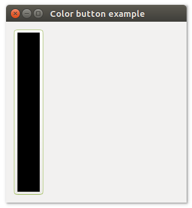
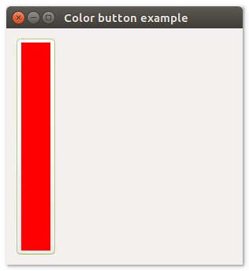
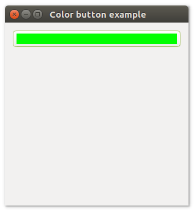
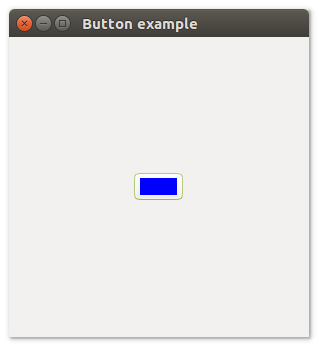

# **uiColorbutton**

## Description

## Functions
- [uiNewColorButton()](#uinewcolorbutton)
- [uiColorButtonColor( uiColorButton, r, g, bl, a )](#uicolorbuttoncolor-uicolorbutton-r-g-bl-a)
- [uiColorButtonOnChanged( uiColorButton, uiColorButton, data)](#uicolorbuttononchanged-uicolorbutton-uicolorbutton-data)
- [uiColorButtonSetColor( uiColorButton, r, g, bl, a )](#uicolorbuttonsetcolor-uicolorbutton-r-g-bl-a)

## uiNewColorButton()
Arguments

Return value

Description

Simple example
```harbour
oColorButton := uiNewColorButton()
```
## uiColorButtonColor (uiColorButton, r, g, bl, a)
Arguments
- uiColorButton
- r
- g
- bl
- a

Return value

Description

Simple example
```harbour
uiColorButtonColor( oColorButton,  r, g, bl, a )
```
## uiColorButtonOnChanged (uiColorButton, uiColorButton, data)
Arguments
- uiColorButton
- uiColorButton
- data

Return value

Description

Simple example
```harbour

```
## uiColorButtonSetColor (uiColorButton, r, g, bl, a)
Arguments
- uiColorButton
- r
- g
- bl
- a

Return value

Description

Simple example
```harbour

```
## Sample source code
```harbour


```
## Sample source code
```harbour
FUNCTION Main()
  LOCAL error
  LOCAL oWindow
  LOCAL oColorButton

  IF ! HB_ISNULL( error := uiInit() )
    Alert( "Failed to initializa libui... " + error )
    RETURN NIL
  ENDIF

  oWindow := uiNewWindow( "Color button example", 300, 300, .T. )
  uiWindowSetMargined( oWindow, 1 )

  oColorButton := uiNewColorButton()

  uiWindowSetChild( oWindow, oColorButton )
  uiControlShow( oWindow )

  uiMain()
  uiUninit()

RETURN NIL
```

## Sample source code
```harbour
FUNCTION Main()
  LOCAL error
  LOCAL oWindow
  LOCAL oColorButton
  LOCAL oHorizontalBox

  IF ! HB_ISNULL( error := uiInit() )
    Alert( "Failed to initializa libui... " + error )
    RETURN NIL
  ENDIF

  oWindow := uiNewWindow( "Color button example", 300, 300, .T. )
  uiWindowSetMargined( oWindow, 1 )

  oColorButton := uiNewColorButton()
  uiColorButtonSetColor( oColorButton, 250, 0, 0, 1 )

  oHorizontalBox := uiNewHorizontalBox()
  uiBoxSetPadded( oHorizontalBox, 1 )
  uiBoxAppend( oHorizontalBox, oColorButton, 0 )

  uiWindowSetChild( oWindow, oHorizontalBox )
  uiControlShow( oWindow )

  uiMain()
  uiUninit()

RETURN NIL
```

## Sample source code
```harbour
FUNCTION Main()
  LOCAL error
  LOCAL oWindow
  LOCAL oColorButton
  LOCAL oVerticalBox

  IF ! HB_ISNULL( error := uiInit() )
    Alert( "Failed to initializa libui... " + error )
    RETURN NIL
  ENDIF

  oWindow := uiNewWindow( "Color button example", 300, 300, .T. )
  uiWindowSetMargined( oWindow, 1 )

  oColorButton := uiNewColorButton()
  uiColorButtonSetColor( oColorButton, 0, 250, 0, 1 )

  oVerticalBox := uiNewVerticalBox()
  uiBoxSetPadded( oVerticalBox, 1 )
  uiBoxAppend( oVerticalBox, oColorButton, 0 )

  uiWindowSetChild( oWindow, oVerticalBox )
  uiControlShow( oWindow )

  uiMain()
  uiUninit()

RETURN NIL
```

## Sample source code
```harbour
#include "hbui.ch"

FUNCTION Main()
  LOCAL error
  LOCAL oWindow
  LOCAL oColorButton
  LOCAL oGrid

  IF ! HB_ISNULL( error := uiInit() )
    Alert( "Failed to initializa libui... " + error )
    RETURN NIL
  ENDIF

  oWindow := uiNewWindow( "Button example", 300, 300, .T. )
  uiWindowSetMargined( oWindow, 1 )

  oColorButton := uiNewColorButton()
  uiColorButtonSetColor( oColorButton, 0, 0, 250, 1 )

  oGrid := uiNewGrid()
  uiGridSetPadded( oGrid, 1 )
  uiGridAppend( oGrid, oColorButton, 0, 0, 1, 1, 1, uiAlignCenter, 1, uiAlignCenter)
	
  uiWindowSetChild( oWindow, oGrid )
  uiControlShow( oWindow )

  uiMain()
  uiUninit()

RETURN NIL
```
