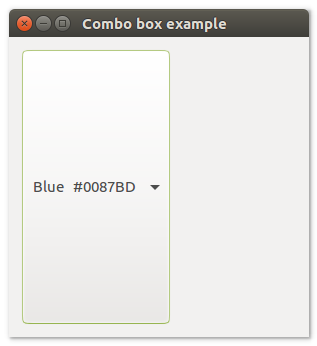
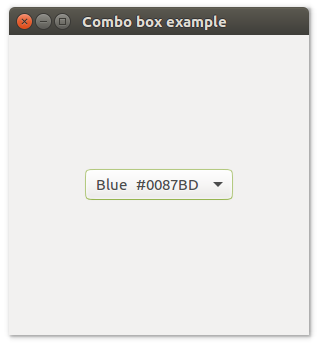

# **uiCombobox**

## Description
uiCombobox is a Control that represents a drop-down list of strings that the user can choose one of at any time. An editable Combobox also has an entry field that the user can type an alternate choice into.

## Functions
- [uiNewCombobox()](#uinewcombobox)
- [uiComboboxAppend( uiCombobox, text )](#uicomboboxappend-uicombobox-text)
- [uiComboboxOnSelected( uiCombobox, uiCombobox, data )](#uicomboboxonselected-uicombobox-uicombobox-data)
- [uiComboboxSelected( uiCombobox )](#uicomboboxselected-uicombobox)
- [uiComboboxSetSelected( uiCombobox, n )](#uicomboboxsetselected-uicombobox-n)

## uiNewCombobox()
Arguments

Return value

Description <br>
uiNewCombobox creates a new Combobox.

Simple example
```harbour
oCombobox() := uiNewCombobox()
```
## uiComboboxAppend (uiCombobox, text)
Arguments
- uiCombobox
- text

Return value

Description

Simple example
```harbour
uiComboboxAppend( oCombobox, "Beautiful F1" )
```
## uiComboboxOnSelected (uiCombobox, uiCombobox, data)
Arguments
- uiCombobox
- uiCombobox
- data

Return value

Description

Simple example
```harbour
uiComboboxOnSelected( oCombobox, onComboboxChanged(), data )
```
## uiComboboxSelected (uiCombobox)
Arguments
- uiCombobox

Return value

Description

Simple example
```harbour
uiComboboxSelected( oCombobox )
```
## uiComboboxSetSelected (uiCombobox, n)
Arguments
- uiCombobox
- n

Return value

Description

Simple example
```harbour
uiComboboxSetSelected( oCombobox, 1 )
```
## Sample source code
```harbour
FUNCTION Main()
  LOCAL error
  LOCAL oWindow
  LOCAL oCombobox

  IF ! HB_ISNULL( error := uiInit() )
    Alert( "Failed to initialize libui... " + error )
    RETURN NIL
  ENDIF

  oWindow := uiNewWindow( "Combo box example", 300, 300, .T. )
  uiWindowSetMargined( oWindow, 1 )

  oCombobox := uiNewCombobox()
  uiComboboxAppend( oCombobox, " White  #FFFFFF ")
  uiComboboxAppend( oCombobox, " Black  #000000 ")
  uiComboboxAppend( oCombobox, " Green  #009F6B ")
  uiComboboxAppend( oCombobox, " Red    #C40233 ")
  uiComboboxAppend( oCombobox, " Yellow #FFD300 ")
  uiComboboxAppend( oCombobox, " Blue   #0087BD ")
  uiComboboxSetSelected( oCombobox, 5 )

  uiWindowSetChild( oWindow, oCombobox )
  uiControlShow( oWindow )

  uiMain()
  uiUninit()

RETURN NIL
```

## Sample source code
```harbour
#include "hbui.ch"

FUNCTION Main()
  LOCAL error
  LOCAL oWindow
  LOCAL oCombobox
  LOCAL oGrid

  IF ! HB_ISNULL( error := uiInit() )
    Alert( "Failed to initialize libui... " + error )
    RETURN NIL
  ENDIF

  oWindow := uiNewWindow( "Combo box example", 300, 300, .T. )
  uiWindowSetMargined( oWindow, 1 )

  oCombobox := uiNewCombobox()
  uiComboboxAppend( oCombobox, " White  #FFFFFF ")
  uiComboboxAppend( oCombobox, " Black  #000000 ")
  uiComboboxAppend( oCombobox, " Green  #009F6B ")
  uiComboboxAppend( oCombobox, " Red    #C40233 ")
  uiComboboxAppend( oCombobox, " Yellow #FFD300 ")
  uiComboboxAppend( oCombobox, " Blue   #0087BD ")
  uiComboboxSetSelected( oCombobox, 5 )

  oGrid := uiNewGrid()
  uiGridSetPadded( oGrid, 1 )
  uiGridAppend( oGrid, oCombobox, 0, 0, 1, 1, 1, uiAlignCenter, 1, uiAlignCenter)

  uiWindowSetChild( oWindow, oGrid )
  uiControlShow( oWindow )

  uiMain()
  uiUninit()

RETURN NIL
```
