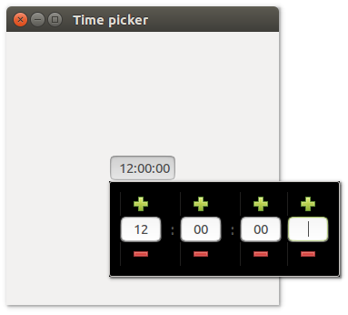
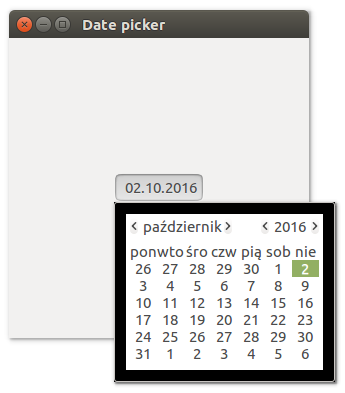
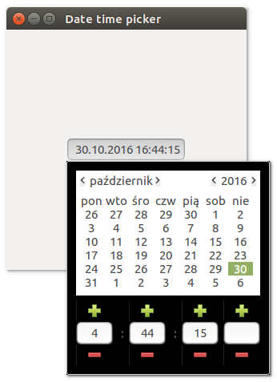

# **uiDatetimepicker**

## Description

## Functions
- [uiNewTimePicker()](#uinewtimepicker)
- [uiNewDatePicker()](#uinewdatepicker)
- [uiNewDateTimePicker()](#uinewdatetimepicker)

## uiNewTimePicker()
Arguments

Return value

Description

Simple example
```harbour
oTimePicker := uiNewTimePicker()
```
## uiNewDatePicker()
Arguments

Return value

Description

Simple example
```harbour
oDatePicker := uiNewDatePicker()
```
## uiNewDateTimePicker()
Arguments

Return value

Description

Simple example
```harbour
oDateTimePicker := uiNewDateTimePicker()
```
## Sample source code
```harbour
#include "hbui.ch"

FUNCTION Main()
  LOCAL error
  LOCAL oWindow
  LOCAL oTimePicker
  LOCAL oGrid

  IF ! HB_ISNULL( error := uiInit() )
    Alert( "Failed to initialize libui... " + error )
    RETURN NIL
  ENDIF

  oWindow := uiNewWindow( "Time picker", 300, 300, .T. )
  uiWindowSetMargined( oWindow, 1 )

  oTimePicker := uiNewTimePicker()

  oGrid := uiNewGrid()
  uiGridSetPadded( oGrid, 1 )
  uiGridAppend( oGrid, oTimePicker, 0, 0, 1, 1, 1, uiAlignCenter, 1, uiAlignCenter)
	
  uiWindowSetChild( oWindow, oGrid )
  uiControlShow( oWindow )

  uiMain()
  uiUninit()

RETURN NIL
```

## Sample source code
```harbour
#include "hbui.ch"

FUNCTION Main()
  LOCAL error
  LOCAL oWindow
  LOCAL oDatePicker
  LOCAL oGrid

  IF ! HB_ISNULL( error := uiInit() )
    Alert( "Failed to initialize libui... " + error )
    RETURN NIL
  ENDIF

  oWindow := uiNewWindow( "Date picker", 300, 300, .T. )
  uiWindowSetMargined( oWindow, 1 )

  oDatePicker := uiNewDatePicker()

  oGrid := uiNewGrid()
  uiGridSetPadded( oGrid, 1 )
  uiGridAppend( oGrid, oDatePicker, 0, 0, 1, 1, 1, uiAlignCenter, 1, uiAlignCenter)
	
  uiWindowSetChild( oWindow, oGrid )
  uiControlShow( oWindow )

  uiMain()
  uiUninit()

RETURN NIL
```
## Screenshots

```harbour
#include "hbui.ch"

FUNCTION Main()
  LOCAL error
  LOCAL oWindow
  LOCAL oDateTimePicker
  LOCAL oGrid

  IF ! HB_ISNULL( error := uiInit() )
    Alert( "Failed to initialize libui... " + error )
    RETURN NIL
  ENDIF

  oWindow := uiNewWindow( "Date time picker", 300, 300, .T. )
  uiWindowSetMargined( oWindow, 1 )

  oDateTimePicker := uiNewDateTimePicker()

  oGrid := uiNewGrid()
  uiGridSetPadded( oGrid, 1 )
  uiGridAppend( oGrid, oDateTimePicker, 0, 0, 1, 1, 1, uiAlignCenter, 1, uiAlignCenter)
	
  uiWindowSetChild( oWindow, oGrid )
  uiControlShow( oWindow )

  uiMain()
  uiUninit()

RETURN NIL
```

