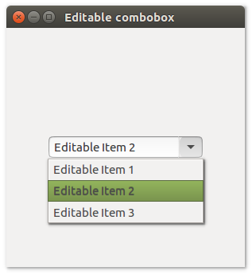

# **uiEditablecombo**

## Description

## Functions
- [uiNewEditableCombobox()](#uineweditablecombobox)
- [uiEditableComboboxAppend( uiEditableCombobox, text )](#uieditablecomboboxappend-uieditablecombobox-text)
- [uiEditableComboboxOnChanged( uiEditableCombobox, uiEditableCombobox, data )](#uieditablecomboboxonchanged-uieditablecombobox-uieditablecombobox-data)
- [uiEditableComboboxSetText( uiEditableCombobox, text )](#uieditablecomboboxsettext-uieditablecombobox-text)
- [uiEditableComboboxText( uiEditableCombobox )](#uieditablecomboboxtext-uieditablecombobox)

## uiNewEditableCombobox()
Arguments

Return value

Description

Simple example
```harbour
oEditableCombobox := uiNewEditableCombobox()
```
## uiEditableComboboxAppend( uiEditableCombobox, text )
Arguments
- uiEditableCombobox
- text

Return value

Description

Simple example
```harbour
uiEditableComboboxAppend( oEditableCombobox, "text" )
```
## uiEditableComboboxOnChanged( uiEditableCombobox, uiEditableCombobox, data )
Arguments
- uiEditableCombobox
- uiEditableCombobox
- data

Return value

Description

Simple example
```harbour
uiEditableComboboxOnChanged( oEditableCombobox, onEditableComboboxChanged(), data )
```
## uiEditableComboboxSetText( uiEditableCombobox, text )
Arguments
- uiEditableCombobox
- text

Return value

Description

Simple example
```harbour
uiEditableComboboxSetText( oEditableCombobox, "text" )
```
## uiEditableComboboxText( uiEditableCombobox )
Arguments
- uiEditableCombobox

Return value

Description

Simple example
```harbour
uiEditableComboboxText( oEditableCombobox )
```
## Sample source code
```harbour
#include "hbui.ch"

FUNCTION Main()
  LOCAL error
  LOCAL oWindow
  LOCAL oEditableCombobox
  LOCAL oGrid

  IF ! HB_ISNULL( error := uiInit() )
    Alert( "Failed to initialize libui... " + error )
    RETURN NIL
  ENDIF

  oWindow := uiNewWindow( "Editable combobox", 300, 300, .T. )
  uiWindowSetMargined( oWindow, 1 )
  
  oEditableCombobox := uiNewEditableCombobox()
  uiEditableComboboxAppend( oEditableCombobox, "Editable Item 1")
  uiEditableComboboxAppend( oEditableCombobox, "Editable Item 2")
  uiEditableComboboxAppend( oEditableCombobox, "Editable Item 3")

  oGrid := uiNewGrid()
  uiGridSetPadded( oGrid, 1 )
  uiGridAppend( oGrid, oEditableCombobox, 0, 0, 1, 1, 1, uiAlignCenter, 1, uiAlignCenter)
	
  uiWindowSetChild( oWindow, oGrid )
  uiControlShow( oWindow )

  uiMain()
  uiUninit()

RETURN NIL
```

