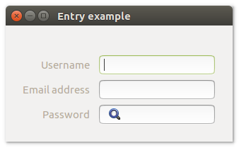

# **uiEntry**

## Description <br>
uiEntry is a Control that represents a space that the user can type a single line of text into.
uiEntry is a flexible control with several possible use

## Functions
- [uiNewEntry()](#uinewentry)
- [uiNewPasswordEntry()](#uinewpasswordentry)
- [uiNewSearchEntry()](#uinewsearchentry)
- [uiEntryOnChanged( uiEntry, Function, data )](#uientryonchanged-uientry-function-data)
- [uiEntryReadOnly( uiEntry )](#uientryreadonly-uientry)
- [uiEntrySetReadOnly( uiEntry, readonly )](#uientrysetreadonly-uientry-readonly)
- [uiEntrySetText( uiEntry, text )](#uientrysettext-uientry-text)
- [uiEntryText( uiEntry )](#uientrytext-uientry)

## uiNewEntry()
Arguments

Return value

Description <br>
uiEntry allow users to display, enter, or edit a text or numeric value.

Simple example
```harbour
oEntry := uiNewEntry()
```
## uiNewPasswordEntry()
Arguments

Return value

Description <br>
A single-line, unconstrained text box used to enter passwords and PINs securely.

Simple example
```harbour
oPasswordEntry := uiNewPasswordEntry()
```
## uiNewSearchEntry()
Arguments

Return value

Description

Simple example
```harbour
oSearchEntry := uiNewSearchEntry()
```
## uiEntryText (uiEntry)
Arguments
- uiEntry

Return value

Description

Simple example
```harbour
uiEntryText( oEntry )
```
## uiEntrySetText (uiEntry, text)
Arguments
- uiEntry
- text

Return value

Description

Simple example
```harbour
uiEntrySetText( oEntry, "Name counterparty" )
```
## uiEntryOnChanged (uiEntry, Function, data)
Arguments
- uiEntry
- Function
- data

Return value

Description

Simple example
```harbour
uiEntryOnChanged( uiEntry, onChanged, 0 )
```
## uiEntryReadOnly (uiEntry)
Arguments
- uiEntry

Return value

Description

Simple example
```harbour
uiEntryReadOnly( oEntry )
```
## uiEntrySetReadOnly (uiEntry, readonly)
Arguments
- uiEntry
- readonly

Return value

Description

Simple example
```harbour
uiEntrySetReadOnly( oEntry, .T. )
```
## Sample source code
```harbour
FUNCTION Main()
  LOCAL error
  LOCAL oWindow
  LOCAL oGroup
  LOCAL oForm
  LOCAL oEntry, oPasswordEntry, oSearchEntry


  IF ! HB_ISNULL( error := uiInit() )
    Alert( "Failed to initialize libui... " + error )
    RETURN NIL
  ENDIF

  oWindow := uiNewWindow( "Entry example", 300, -1, .T. )
  uiWindowSetMargined( oWindow, 1 )

  oGroup := uiNewGroup("")
  uiGroupSetMargined( oGroup, 1)

  oForm := uiNewForm()
  uiFormSetPadded( oForm, 1 )
  uiGroupSetChild( oGroup, oForm )

  oEntry         := uiNewEntry()
  oPasswordEntry := uiNewPasswordEntry()
  oSearchEntry   := uiNewSearchEntry()

  uiFormAppend( oForm, "Username", oEntry, 0 )
  uiFormAppend( oForm, "Email address", oPasswordEntry, 0 )
  uiFormAppend( oForm, "Password", oSearchEntry, 0 )

  uiWindowSetChild( oWindow, oGroup )
  uiControlShow( oWindow )

  uiMain()
  uiUninit()

RETURN NIL
```

