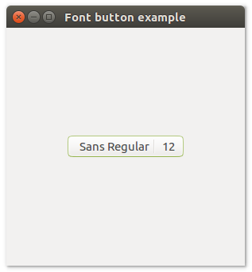

# **uiFontbutton**

## Description

## Functions
- [uiNewFontButton()](#uinewfontbutton)
- [uiFontButtonFont( uiFontButton )](#uifontbuttonfont-uifontbutton)
- [uiFontButtonOnChanged( uiFontButton, uiFontButton, data )](#uifontbuttononchanged-uifontbutton-uifontbutton-data)

## uiNewFontButton()
Arguments

Return value

Description

Simple example
```harbour
oFontButton := uiNewFontButton()
```
## uiFontButtonFont (uiFontButton)
Arguments
- uiFontButton

Return value

Description

Simple example
```harbour
uiFontButtonFont( oFontButton )
```
## uiFontButtonOnChanged (uiFontButton, uiFontButton, data)
Arguments
- uiFontButton
- uiFontButton
- data

Return value

Description

Simple example
```harbour
uiFontButtonOnChanged( oFontButton, onFontChanged(), 0 )
```
## Sample source code
```harbour
#include "hbui.ch"

FUNCTION Main()
  LOCAL error
  LOCAL oWindow
  LOCAL oFontButton
  LOCAL oGrid

  IF ! HB_ISNULL( error := uiInit() )
    Alert( "Failed to initialize libui... " + error )
    RETURN NIL
  ENDIF

  oWindow := uiNewWindow( "Font button example", 300, 300, .T. )
  uiWindowSetMargined( oWindow, 1 )

  oFontButton := uiNewFontButton()

  oGrid := uiNewGrid()
  uiGridSetPadded( oGrid, 1 )
  uiGridAppend( oGrid, oFontButton, 0, 0, 1, 1, 1, uiAlignCenter, 1, uiAlignCenter)
	
  uiWindowSetChild( oWindow, oGrid )
  uiControlShow( oWindow )

  uiMain()
  uiUninit()

RETURN NIL
```

