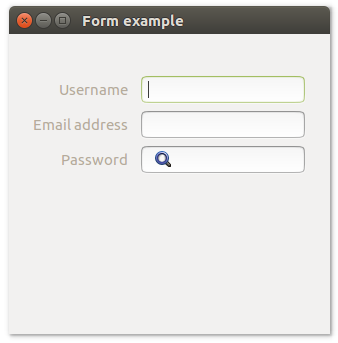

# **uiForm**

## Description

## Functions
- [uiNewForm()](#uinewform)
- [uiFormAppend( uiForm, label, uiControl, stretchy )](#uiformappend-uiform-label-uicontrol-stretchy)
- [uiFormDelete( uiForm, index )](#uiformdelete-uiform-index)
- [uiFormPadded( uiForm )](#uiformpadded-uiform)
- [uiFormSetPadded( uiForm, padded )](#uiformsetpadded-uiform-padded)

## uiNewForm()
Arguments

Return value

Description

Simple example
```harbour
oForm := uiNewForm()
```
## uiFormAppend (uiForm, label, uiControl, stretchy)
Arguments
- uiForm
- label
- uiControl
- stretchy

Return value

Description

Simple example
```harbour
uiFormAppend( oForm, "Password Entry", uiNewPasswordEntry(), .F. )
```
## uiFormDelete (uiForm, index)
Arguments
- uiForm
- index

Return value

Description

Simple example
```harbour
uiFormDelete( oForm, 1 )
```
## uiFormPadded (uiForm)
Arguments
- uiForm

Return value

Description

Simple example
```harbour
uiFormPadded( oForm )
```
## uiFormSetPadded (uiForm, padded)
Arguments
- uiForm
- padded

Return value

Description

Simple example
```harbour
uiFormSetPadded( oForm, .T. )
```
## Sample source code
```harbour
FUNCTION Main()
  LOCAL error
  LOCAL oWindow
  LOCAL oGroup
  LOCAL oForm
  LOCAL oEntry, oPasswordEntry, oSearchEntry


  IF ! HB_ISNULL( error := uiInit() )
    Alert( "Failed to initialize libui... " + error )
    RETURN NIL
  ENDIF

  oWindow := uiNewWindow( "Form example", 300, 300, .T. )
  uiWindowSetMargined( oWindow, 1 )

  oGroup := uiNewGroup("")
  uiGroupSetMargined( oGroup, 1)

  oForm := uiNewForm()
  uiFormSetPadded( oForm, 1 )
  uiGroupSetChild( oGroup, oForm )

  oEntry         := uiNewEntry()
  oPasswordEntry := uiNewPasswordEntry()
  oSearchEntry   := uiNewSearchEntry()

  uiFormAppend( oForm, "Username", oEntry, 0 )
  uiFormAppend( oForm, "Email address", oPasswordEntry, 0 )
  uiFormAppend( oForm, "Password", oSearchEntry, 0 )

  uiWindowSetChild( oWindow, oGroup )
  uiControlShow( oWindow )

  uiMain()
  uiUninit()

RETURN NIL
```

