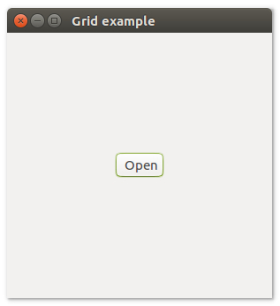

# **uiGrid**

## Description

## Functions
- [uiNewGrid()](#uiNewGrid)
- [uiGridAppend( uiGrid, uiControl, left, top, xspan, yspan, hexpand, uiAlign halign, vexpand, uiAlign valign )](#uiGridAppend-uiGrid-uiControl-left-top-xspan-yspan-hexpand-uiAlign-halign-vexpand-uiAlign-valign)
- [uiGridInsertAt( uiGrid, uiControl, uiControl, uiAt at, xspan, yspan, hexpand, uiAlign halign, vexpand, uiAlign valign )](#uiGridInsertAt-uiGrid-uiControl-uiControl-uiAt-at-xspan-yspan-hexpand-uiAlign-halign-vexpand-uiAlign-valign)
- [uiGridPadded( uiGrid )](#uiGridPadded-uiGrid)
- [uiGridSetPadded( uiGrid, padded )](#uiGridSetPadded-uiGrid-padded)

## uiNewGrid()
Arguments

Return value

Description

Simple example
```harbour
oGrid := uiNewGrid()
```
## uiGridAppend (uiGrid, uiControl, left, top, xspan, yspan, hexpand, uiAlign halign, vexpand, uiAlign valign)
- Arguments
- uiGrid
- uiControl
- left
- top
- xspan
- yspan
- hexpand
- uiAlign halign
- vexpand
- uiAlign valign

Return value

Description

Simple example
```harbour
uiGridAppend( oGrid, oButton, 0, 0, 1, 1, 0, uiAlignFill, 0, uiAlignFill )
```
## uiGridInsertAt (uiGrid, uiControl, uiControl, uiAt at, xspan, yspan, hexpand, uiAlign halign, vexpand, uiAlign valign)
- Arguments
- uiGrid
- uiControl
- uiControl
- uiAt at
- xspan
- yspan
- hexpand
- uiAlign halign
- vexpand
- uiAlign valign

Return value

Description

Simple example
```harbour

```
## uiGridPadded (uiGrid)
Arguments
- uiGrid

Return value

Description

Simple example
```harbour

```
## uiGridSetPadded (uiGrid, padded)
Arguments
- uiGrid
- padded

Return value

Description

Simple example
```harbour

```
## Sample source code
```harbour
#include "hbui.ch"

FUNCTION Main()
  LOCAL error
  LOCAL oWindow
  LOCAL oButton
  LOCAL oGrid

  IF ! HB_ISNULL( error := uiInit() )
    Alert( "Failed to initializa libui... " + error )
    RETURN NIL
  ENDIF

  oWindow := uiNewWindow( "Grid example", 300, 300, .T. )
  uiWindowSetMargined( oWindow, 1 )

  oButton := uiNewButton( "Open" )

  oGrid := uiNewGrid()
  uiGridSetPadded( oGrid, 1 )
  uiGridAppend( oGrid, oButton, 0, 0, 1, 1, 1, uiAlignCenter, 1, uiAlignCenter)
	
  uiWindowSetChild( oWindow, oGrid )
  uiControlShow( oWindow )

  uiMain()
  uiUninit()

RETURN NIL
```
## Screenshots

