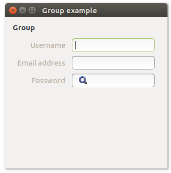
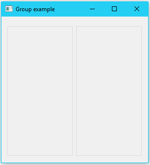
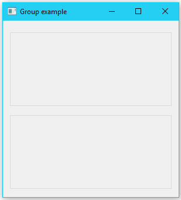

# **uiGroup**

## Description

## Functions
- [uiNewGroup( title )](#uinewgroup-title)
- [uiGroupMargined( uiGroup )](#uigroupmargined-uigroup)
- [uiGroupSetChild( uiGroup, uiControl )](#uigroupsetchild-uigroup-uicontrol)
- [uiGroupSetMargined( uiGroup, margined )](#uigroupsetmargined-uigroup-margined)
- [uiGroupSetTitle( uiGroup, title )](#uigroupsettitle-uigroup-title)
- [uiGroupTitle( uiGroup )](#uigrouptitle-uigroup)

## uiNewGroup (title)
Arguments
- title

Return value

Description

Simple example
```harbour
oGroup := uiNewGroup( "title" )
```
## uiGroupMargined (uiGroup)
Arguments
- uiGroup

Return value

Description

Simple example
```harbour
uiGroupMargined( oGroup )
```
## uiGroupSetChild (uiGroup, uiControl)
Arguments
- uiGroup
- uiControl

Return value

Description

Simple example
```harbour
uiGroupSetChild( oGroup, oVerticalBox )
```
## uiGroupSetMargined (uiGroup, margined)
Arguments
- uiGroup
- margined 

Return value

Description

Simple example
```harbour
uiGroupSetMargined( oGroup, .T. )
```
## uiGroupSetTitle (uiGroup, title)
Arguments
- uiGroup
- title

Return value

Description

Simple example
```harbour
uiGroupSetTitle( oGroup, "new title" )
```
## uiGroupTitle (uiGroup)
Arguments
- uiGroup

Return value

Description

Simple example
```harbour
uiGroupTitle( oGroup )
```
## Sample source code
```harbour
FUNCTION Main()
  LOCAL error
  LOCAL oWindow
  LOCAL oGroup
  LOCAL oForm
  LOCAL oEntry, oPasswordEntry, oSearchEntry

  IF ! HB_ISNULL( error := uiInit() )
    Alert( "Failed to initialize libui... " + error )
    RETURN NIL
  ENDIF

  oWindow := uiNewWindow( "Group example", 300, 300, .T. )
  uiWindowSetMargined( oWindow, 1 )

  oGroup := uiNewGroup( "Group" )
  uiGroupSetMargined( oGroup, .T. )

  oForm := uiNewForm()
  uiFormSetPadded( oForm, 1 )
  uiGroupSetChild( oGroup, oForm )

  oEntry         := uiNewEntry()
  oPasswordEntry := uiNewPasswordEntry()
  oSearchEntry   := uiNewSearchEntry()

  uiFormAppend( oForm, "Username", oEntry, 0 )
  uiFormAppend( oForm, "Email address", oPasswordEntry, 0 )
  uiFormAppend( oForm, "Search", oSearchEntry, 0 )

  uiWindowSetChild( oWindow, oGroup )
  uiControlShow( oWindow )

  uiMain()
  uiUninit()

RETURN NIL
```

## Sample source code
```harbour
FUNCTION Main()
  LOCAL error
  LOCAL oWindow
  LOCAL oHorizontalBox
  LOCAL oGroup

  IF ! HB_ISNULL( error := uiInit() )
    Alert( "Failed to initialize libui... " + error )
    RETURN NIL
  ENDIF

  oWindow := uiNewWindow( "Group example", 300, 300, 1 )
  uiWindowSetMargined( oWindow, 1 )

  oHorizontalBox := uiNewHorizontalBox()
  uiBoxSetPadded( oHorizontalBox, 1 )

  oGroup := uiNewGroup( "" )
  uiGroupSetMargined( oGroup, 1 )
  uiBoxAppend( oHorizontalBox, oGroup, 1 )

  oGroup := uiNewGroup( "" )
  uiGroupSetMargined( oGroup, 1 )
  uiBoxAppend( oHorizontalBox, oGroup, 1 )


  uiWindowSetChild( oWindow, oHorizontalBox )
  uiControlShow( oWindow )

  uiMain()
  uiUninit()

RETURN NIL
```

## Sample source code
```harbour
FUNCTION Main()
  LOCAL error
  LOCAL oWindow
  LOCAL oVerticalBox
  LOCAL oGroup

  IF ! HB_ISNULL( error := uiInit() )
    Alert( "Failed to initialize libui... " + error )
    RETURN NIL
  ENDIF

  oWindow := uiNewWindow( "Group example", 300, 300, 1 )
  uiWindowSetMargined( oWindow, 1 )

  oVerticalBox := uiNewVerticalBox()
  uiBoxSetPadded( oVerticalBox, 1 )

  oGroup := uiNewGroup( "" )
  uiGroupSetMargined( oGroup, 1 )
  uiBoxAppend( oVerticalBox, oGroup, 1 )

  oGroup := uiNewGroup( "" )
  uiGroupSetMargined( oGroup, 1 )
  uiBoxAppend( oVerticalBox, oGroup, 1 )


  uiWindowSetChild( oWindow, oVerticalBox )
  uiControlShow( oWindow )

  uiMain()
  uiUninit()

RETURN NIL
```
