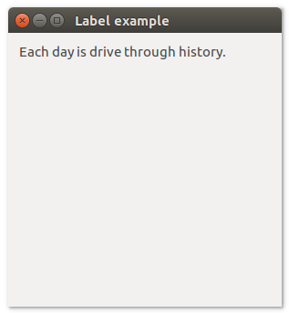
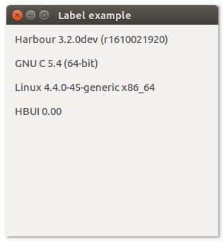

# **uiLabel**

## Description

## Functions
- [uiNewLabel( text )](#uinewlabel-text)
- [uiLabelSetText( uiLabel, text )](#uilabelsettext-uilabel-text)
- [uiLabelText( uiLabel )](#uilabeltext-uilabel)

## uiNewLabel (text)
Arguments
- text

Return value

Description

Simple example
```harbour
oLabel := uiNewLabel( "Good morning" )
```
## uiLabelSetText (uiLabel, text)
Arguments
- uiLabel
- text

Return value

Description

Simple example
```harbour
uiLabelSetText( oLabel, "If you are going through hell, keep going!" )
```
## uiLabelText (uiLabel)
Arguments
- uiLabel

Return value

Description

Simple example
```harbour
uiLabelText( oLabel )
```
## Sample source code
```harbour
FUNCTION Main()
  LOCAL error
  LOCAL oWindow
  LOCAL oLabel

  IF ! HB_ISNULL( error := uiInit() )
    Alert( "Failed to initializa libui... " + error )
    RETURN NIL
  ENDIF

  oWindow := uiNewWindow( "Label example", 300, 300, .T. )
  uiWindowSetMargined( oWindow, 1 )

  oLabel := uiNewLabel( "Each day is dri­ve through his­to­ry." )

  uiWindowSetChild( oWindow, oLabel )

  uiControlShow( oWindow )

  uiMain()
  uiUninit()

RETURN NIL
```

## Sample source code
Example use function:
- [hb_eol()](http://harbour.edu.pl/harbour/doc/harbour.html#hb_eol)
```harbour
FUNCTION Main()
  LOCAL error
  LOCAL oWindow
  LOCAL oLabel

  IF ! HB_ISNULL( error := uiInit() )
    Alert( "Failed to initializa libui... " + error )
    RETURN NIL
  ENDIF

  oWindow := uiNewWindow( "Label example", 300, 300, .T. )
  uiWindowSetMargined( oWindow, 1 )

  oLabel := uiNewLabel( Version()     + hb_eol() + ;
                                        hb_eol() + ;
                        hb_Compiler() + hb_eol() + ;
                                        hb_eol() + ;
                        OS()          + hb_eol() + ;
                                        hb_eol() + ;
                        "HBUI 0.00"  )

  uiWindowSetChild( oWindow, oLabel )

  uiControlShow( oWindow )

  uiMain()
  uiUninit()

RETURN NIL
```
