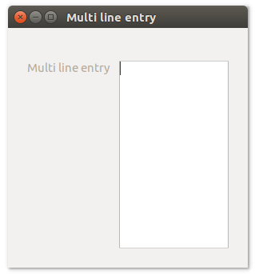
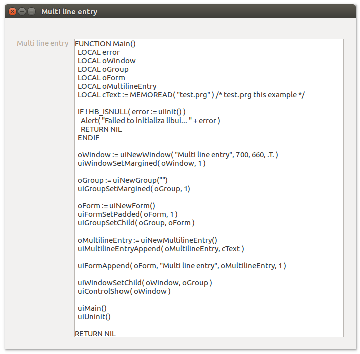
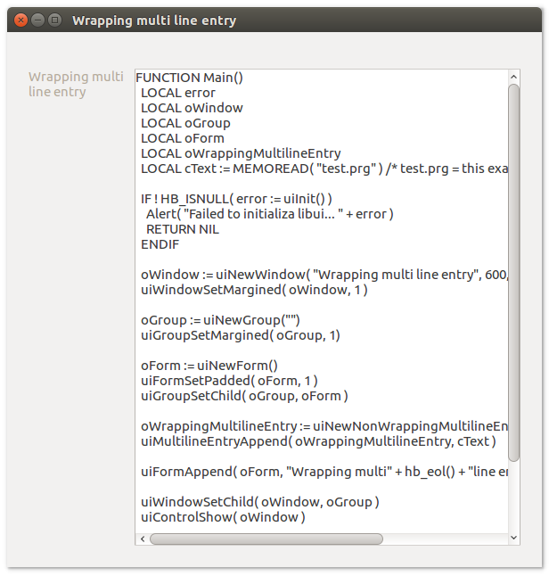

# **uiMultilineentry**

## Description <br>
uiMultilineentry, unconstrained text box used to enter or edit long strings.

## Functions
- [uiNewMultilineEntry()](#uinewmultilineentry)
- [uiNewNonWrappingMultilineEntry()](#uinewnonwrappingmultilineentry)
- [uiMultilineEntryAppend( uiMultilineEntry, text )](#uimultilineentryappend-uimultilineentry-text)
- [uiMultilineEntryOnChanged( uiMultilineEntry, meChanged, data)](#uimultilineentryonchanged-uimultilineentry-mechanged-data)
- [uiMultilineEntryReadOnly( uiMultilineEntry )](#uimultilineentryreadonly-uimultilineentry)
- [uiMultilineEntrySetReadOnly( uiMultilineEntry, readonly )](#uimultilineentrysetreadonly-uimultilineentry-readonly)
- [uiMultilineEntrySetText( uiMultilineEntry, text )](#uimultilineentrysettext-uimultilineentry-text)
- [uiMultilineEntryText( uiMultilineEntry )](#uimultilineentrytext-uimultilineentry)

## uiNewMultilineEntry()
Arguments

Return value

Description

Simple example
```harbour
oMultilineEntry := uiNewMultilineEntry()
```
## uiNewNonWrappingMultilineEntry()
Arguments

Return value

Description

Simple example
```harbour
oWrappingMultilineEntry := uiNewNonWrappingMultilineEntry()
```
## uiMultilineEntryAppend (uiMultilineEntry, text)
Arguments
- uiMultilineEntry
- text

Return value

Description

Simple example
```harbour
uiMultilineEntryAppend( oMultilineEntry, "append" )
```
## uiMultilineEntryOnChanged (uiMultilineEntry, meChanged, data)
Arguments
- uiMultilineEntry
- meChanged
- data

Return value

Description

Simple example
```harbour
uiMultilineEntryOnChanged( oMultilineEntry, {|| meChanged() }, data )
```
## uiMultilineEntryReadOnly (uiMultilineEntry)
Arguments
- uiMultilineEntry

Return value

Description

Simple example
```harbour
uiMultilineEntryReadOnly( oMultilineEntry )
```
## uiMultilineEntrySetReadOnly (uiMultilineEntry, readonly)
Arguments
- uiMultilineEntry
- readonly

Return value

Description

Simple example
```harbour
uiMultilineEntrySetReadOnly( oMultilineEntry, .T. )
```
## uiMultilineEntrySetText (uiMultilineEntry, text)
Arguments
- uiMultilineEntry
- text

Return value

Description

Simple example
```harbour
uiMultilineEntrySetText( oMultilineEntry, "Set" )
```
## uiMultilineEntryText (uiMultilineEntry)
Arguments
- uiMultilineEntry

Return value

Description

Simple example
```harbour
uiMultilineEntryText( oMultilineEntry )
```
## Sample source code
```harbour
FUNCTION Main()
  LOCAL error
  LOCAL oWindow
  LOCAL oGroup
  LOCAL oForm
  LOCAL oMultilineEntry

  IF ! HB_ISNULL( error := uiInit() )
    Alert( "Failed to initialize libui... " + error )
    RETURN NIL
  ENDIF

  oWindow := uiNewWindow( "Multi line entry", 300, 300, .T. )
  uiWindowSetMargined( oWindow, 1 )

  oGroup := uiNewGroup("")
  uiGroupSetMargined( oGroup, 1)

  oForm := uiNewForm()
  uiFormSetPadded( oForm, 1 )
  uiGroupSetChild( oGroup, oForm )

  oMultilineEntry := uiNewMultilineEntry()

  uiFormAppend( oForm, "Multi line entry", oMultilineEntry, 1 )

  uiWindowSetChild( oWindow, oGroup )
  uiControlShow( oWindow )

  uiMain()
  uiUninit()

RETURN NIL
```

## Sample source code
Example use function:
- [MEMOREAD()](http://harbour.edu.pl/harbour/doc/harbour.html#memoread)
```harbour
FUNCTION Main()
  LOCAL error
  LOCAL oWindow
  LOCAL oGroup
  LOCAL oForm
  LOCAL oMultilineEntry
  LOCAL cText := MEMOREAD( "test.prg" ) /* test.prg this example */  

  IF ! HB_ISNULL( error := uiInit() )
    Alert( "Failed to initialize libui... " + error )
    RETURN NIL
  ENDIF

  oWindow := uiNewWindow( "Multi line entry", 700, 660, .T. )
  uiWindowSetMargined( oWindow, 1 )

  oGroup := uiNewGroup("")
  uiGroupSetMargined( oGroup, 1)

  oForm := uiNewForm()
  uiFormSetPadded( oForm, 1 )
  uiGroupSetChild( oGroup, oForm )

  oMultilineEntry := uiNewMultilineEntry()
  uiMultilineEntryAppend( oMultilineEntry, cText )  

  uiFormAppend( oForm, "Multi line entry", oMultilineEntry, 1 )

  uiWindowSetChild( oWindow, oGroup )
  uiControlShow( oWindow )

  uiMain()
  uiUninit()

RETURN NIL
```

## Sample source code
```harbour
FUNCTION Main()
  LOCAL error
  LOCAL oWindow
  LOCAL oGroup
  LOCAL oForm
  LOCAL oWrappingMultilineEntry

  IF ! HB_ISNULL( error := uiInit() )
    Alert( "Failed to initialize libui... " + error )
    RETURN NIL
  ENDIF

  oWindow := uiNewWindow( "Wrapping multi line entry", 300, 300, .T. )
  uiWindowSetMargined( oWindow, 1 )

  oGroup := uiNewGroup("")
  uiGroupSetMargined( oGroup, 1)

  oForm := uiNewForm()
  uiFormSetPadded( oForm, 1 )
  uiGroupSetChild( oGroup, oForm )

  oWrappingMultilineEntry := uiNewNonWrappingMultilineEntry()

  uiFormAppend( oForm, "Wrapping multi" + hb_eol() + "line entry", oWrappingMultilineEntry, 1 )

  uiWindowSetChild( oWindow, oGroup )
  uiControlShow( oWindow )

  uiMain()
  uiUninit()

RETURN NIL
```

## Sample source code
Example use function:
- [MEMOREAD()](http://harbour.edu.pl/harbour/doc/harbour.html#memoread)
```harbour
FUNCTION Main()
  LOCAL error
  LOCAL oWindow
  LOCAL oGroup
  LOCAL oForm
  LOCAL oWrappingMultilineEntry
  LOCAL cText := MEMOREAD( "test.prg" ) /* test.prg = this example */  

  IF ! HB_ISNULL( error := uiInit() )
    Alert( "Failed to initialize libui... " + error )
    RETURN NIL
  ENDIF

  oWindow := uiNewWindow( "Wrapping multi line entry", 300, 300, .T. )
  uiWindowSetMargined( oWindow, 1 )

  oGroup := uiNewGroup("")
  uiGroupSetMargined( oGroup, 1)

  oForm := uiNewForm()
  uiFormSetPadded( oForm, 1 )
  uiGroupSetChild( oGroup, oForm )

  oWrappingMultilineEntry := uiNewNonWrappingMultilineEntry()
  uiMultilineEntryAppend( oWrappingMultilineEntry, cText )  

  uiFormAppend( oForm, "Wrapping multi" + hb_eol() + "line entry", oWrappingMultilineEntry, 1 )

  uiWindowSetChild( oWindow, oGroup )
  uiControlShow( oWindow )

  uiMain()
  uiUninit()

RETURN NIL
```
