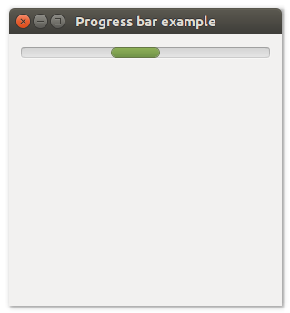

# **uiProgressbar**

## Description
uiProgressBar is a Control that represents a horizontal bar that is filled in progressively over time as a process completes.
uiProgressbar allow users to follow the progress of a lengthy operation.

## Functions
- [uiNewProgressBar()](#uinewprogressbar)
- [uiProgressBarSetValue( uiProgressBar, n )](#uiprogressbarsetvalue-uiprogressbar-n)
- [uiProgressBarValue( uiProgressBar )](#uiprogressbarvalue-uiprogressbar)

## uiNewProgressBar()
Arguments

Return value

Description <br>
uiNewProgressBar creates a new ProgressBar.

Simple example
```harbour
oProgressBar := uiNewProgressBar()
```
## uiProgressBarSetValue (uiProgressBar, n)
Arguments
- uiProgressBar
- n

Return value

Description

Simple example
```harbour
uiProgressBarSetValue( oProgressBar, 100 )
```
## uiProgressBarValue (uiProgressBar)
Arguments
- uiProgressBar

Return value

Description

Simple example
```harbour
uiProgressBarValue( oProgressBar )
```
## Sample source code
```harbour
FUNCTION Main()
  LOCAL error
  LOCAL oWindow
  LOCAL oVerticalBox
  LOCAL oProgressBar

  IF ! HB_ISNULL( error := uiInit() )
    Alert( "Failed to initialize libui... " + error )
    RETURN NIL
  ENDIF

  oWindow := uiNewWindow( "Progress bar example", 300, 300, .T. )
  uiWindowSetMargined( oWindow, 1 )

  oProgressBar := uiNewProgressBar()
  uiProgressBarSetValue( oProgressBar, -1 )

  oVerticalBox := uiNewVerticalBox()
  uiBoxSetPadded( oVerticalBox, 1 )
  uiBoxAppend( oVerticalBox, oProgressBar, 0 )

  uiWindowSetChild( oWindow, oVerticalBox )
  uiControlShow( oWindow )

  uiMain()
  uiUninit()

RETURN NIL
```

