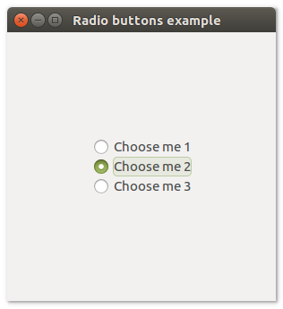

# **uiRadiobuttons**

## Description
uiRadioButtons is a Control that represents a set of checkable buttons from which exactly one may be chosen by the user.
uiRadiobuttons allow users to make a choice among a set of mutually exclusive, related choices.

## Functions
- [uiNewRadioButtons()](#uinewradiobuttons)
- [uiRadioButtonsAppend( uiRadioButtons, text )](#uiradiobuttonsappend-uiradiobuttons-text)
- [uiRadioButtonsOnSelected( uiRadioButtons, uiRadioButtons, data )](#uiradiobuttonsonselected-uiradiobuttons-uiradiobuttons-data)
- [uiRadioButtonsSelected( uiRadioButtons )](#uiradiobuttonsselected-uiradiobuttons)
- [uiRadioButtonsSetSelected( uiRadioButtons, n )](#uiradiobuttonssetselected-uiradiobuttons-n)

## uiNewRadioButtons()
Arguments

Return value

Description <br>
uiNewRadioButtons creates a new RadioButtons.

Simple example
```harbour
oRadioButtons := uiNewRadioButtons()
```
## uiRadioButtonsAppend (uiRadioButtons, text)
Arguments
- uiRadioButtons
- text

Return value

Description

Simple example
```harbour
uiRadioButtonsAppend( oRadioButtons, "text" )
```
## uiRadioButtonsOnSelected (uiRadioButtons, uiRadioButtons, data)
Arguments
- uiRadioButtons
- uiRadioButtons
- data

Return value

Description

Simple example
```harbour
uiRadioButtonsOnSelected( oRadioButtons, FRadioButtons(), NIL )
```
## uiRadioButtonsSelected (uiRadioButtons)
Arguments
- uiRadioButtons

Return value

Description

Simple example
```harbour
uiRadioButtonsSelected( oRadioButtons )
```
## uiRadioButtonsSetSelected (uiRadioButtons, n)
Arguments
- uiRadioButtons
- n

Return value

Description

Simple example
```harbour
uiRadioButtonsSetSelected( oRadioButtons, 10 )
```
## Sample source code
```harbour
#include "hbui.ch"

FUNCTION Main()
  LOCAL error
  LOCAL oWindow
  LOCAL oRadiobuttons
  LOCAL oGrid

  IF ! HB_ISNULL( error := uiInit() )
    Alert( "Failed to initialize libui... " + error )
    RETURN NIL
  ENDIF

  oWindow := uiNewWindow( "Radio buttons example", 300, 300, .T. )
  uiWindowSetMargined( oWindow, 1 )

  oRadiobuttons := uiNewRadioButtons()
  uiRadioButtonsAppend( oRadiobuttons, "Choose me 1" )
  uiRadioButtonsAppend( oRadiobuttons, "Choose me 2" )
  uiRadioButtonsAppend( oRadiobuttons, "Choose me 3" )

  oGrid := uiNewGrid()
  uiGridSetPadded( oGrid, 1 )
  uiGridAppend( oGrid, oRadiobuttons, 0, 0, 1, 1, 1, uiAlignCenter, 1, uiAlignCenter )
	
  uiWindowSetChild( oWindow, oGrid )
  uiControlShow( oWindow )

  uiMain()
  uiUninit()

RETURN NIL
```

