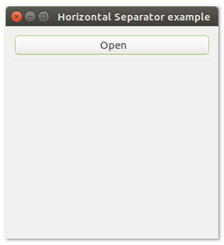
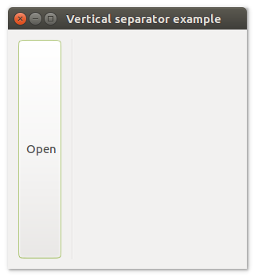

# **uiSeparator**

## Description
uiSeparator is a Control that represents a horizontal line that visually separates controls.

## Functions
- [uiNewHorizontalSeparator()](#uinewhorizontalseparator)
- [uiNewVerticalSeparator()](#uinewverticalseparator)


## uiNewHorizontalSeparator()
Arguments

Return value

Description <br>
uiNewSeparator creates a new horizontal Separator.

Simple example
```harbour
oHorizontalSeparator := uiNewHorizontalSeparator()
```
## uiNewVerticalSeparator()
Arguments

Return value

Description <br>
uiNewSeparator creates a new vertical Separator.

Simple example
```harbour
oVerticalSeparator := uiNewVerticalSeparator()
```
## Sample source code
```harbour
FUNCTION Main()
  LOCAL error
  LOCAL oWindow
  LOCAL oButton
  LOCAL oVerticalBox

  IF ! HB_ISNULL( error :=  uiInit() )
    Alert( "Failed to initialize libui... " + error )
    RETURN NIL
  ENDIF

  oWindow := uiNewWindow( "Horizontal Separator example", 300, 300, .T. )
  uiWindowSetMargined( oWindow, 1 )

  oButton := uiNewButton( "Open" )

  oVerticalBox := uiNewVerticalBox()
  uiBoxSetPadded( oVerticalBox, 1 )
  uiBoxAppend( oVerticalBox, oButton, 0 )
  uiBoxAppend ( oVerticalBox, uiNewHorizontalSeparator(), 0 )

  uiWindowSetChild( oWindow, oVerticalBox )
  uiControlShow( oWindow )

  uiMain()
  uiUninit()

RETURN NIL
```

## Sample source code
```harbour
FUNCTION Main()
  LOCAL error
  LOCAL oWindow
  LOCAL oButton
  LOCAL oHorizontalBox

  IF ! HB_ISNULL( error := uiInit() )
    Alert( "Failed to initialize libui... " + error )
    RETURN NIL
  ENDIF

  oWindow := uiNewWindow( "Vertical separator example", 300, 300, .T. )
  uiWindowSetMargined( oWindow, 1 )

  oButton := uiNewButton( "Open" )

  oHorizontalBox := uiNewHorizontalBox()
  uiBoxSetPadded( oHorizontalBox, 1 )
  uiBoxAppend( oHorizontalBox, oButton, 0 )
  uiBoxAppend ( oHorizontalBox, uiNewVerticalSeparator(), 0 )

  uiWindowSetChild( oWindow, oHorizontalBox )
  uiControlShow( oWindow )

  uiMain()
  uiUninit()

RETURN NIL
```
