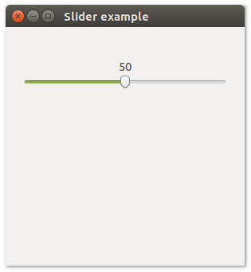

# **uiSlider**

## Description
uiSlider is a Control that represents a horizontal bar that represents a range of integers. The user can drag a pointer on the bar to select an integer.
uiSlider allow users to choose from a continuous range of values.

## Functions
- [uiNewSlider( min, max )](#uinewslider-min-max)
- [uiSliderOnChanged( uiSlider, uiSlider, data )](#uislideronchanged-uislider-uislider-data)
- [uiSliderSetValue( uiSlider, value )](#uislidersetvalue-uislider-value)
- [uiSliderValue( uiSlider )](#uislidervalue-uislider)

## uiNewSlider (min, max)
Arguments
- min
- max

Return value

Description <br>
uiNewSlider creates a new Slider. If min >= max, they are swapped.

Simple example
```harbour
oSlider := uiNewSlider( 0, 100 )
```
## uiSliderOnChanged (uiSlider, uiSlider, data)
Arguments
- uiSlider
- uiSlider
- data

Return value

Description

Simple example
```harbour
uiSliderOnChanged( oSlider, onSliderChanged, NIL )
```
## uiSliderSetValue (uiSlider, value)
Arguments
- uiSlider
- value

Return value

Description

Simple example
```harbour
uiSliderSetValue( oSlider, value )
```
## uiSliderValue (uiSlider)
Arguments
- uiSlider

Return value

Description

Simple example
```harbour
uiSliderValue( oSlider )
```
## Sample source code
```harbour
FUNCTION Main()
  LOCAL error
  LOCAL oWindow
  LOCAL oHorizontalBox
  LOCAL oGroup
  LOCAL oVerticalBox
  LOCAL oSlider
  
  IF ! HB_ISNULL( error := uiInit() )
    Alert( "Failed to initialize libui... " + error )
    RETURN NIL
  ENDIF

  oWindow := uiNewWindow( "Slider example", 300, 300, .T. )
  uiWindowSetMargined( oWindow, 1 )

  oHorizontalBox := uiNewHorizontalBox()
  uiBoxSetPadded( oHorizontalBox, 1 )

  oGroup := uiNewGroup("")
  uiGroupSetMargined( oGroup, 1 )
  uiBoxAppend( oHorizontalBox, oGroup, 1 )

  oVerticalBox := uiNewVerticalBox()
  uiBoxSetPadded( oVerticalBox, 1 )
  uiGroupSetChild( oGroup, oVerticalBox )

  oSlider := uiNewSlider( 0, 100 )

  uiBoxAppend( oVerticalBox, oSlider, 0 )

  uiWindowSetChild( oWindow, oHorizontalBox )
  uiControlShow( oWindow )

  uiMain()
  uiUninit()

RETURN NIL
```

