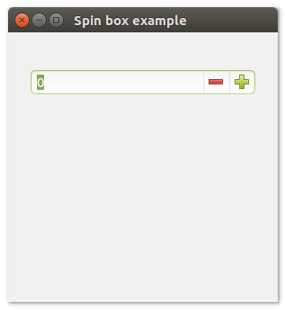

# **uiSpinbox**

## Description
uiSpinbox is a Control that represents a space where the user can enter integers. The space also comes with buttons to add or subtract 1 from the integer.
uiSpinbox allow users to change incrementally the value within its associated numeric text box.

## Functions
- [uiNewSpinbox( min, max )](#uinewspinbox-min-max)
- [uiSpinboxOnChanged( uiSpinbox, uiSpinbox, data )](#uispinboxonchanged-uispinbox-uispinbox-data)
- [uiSpinboxSetValue( uiSpinbox, value )](#uispinboxsetvalue-uispinbox-value)
- [uiSpinboxValue( uiSpinbox )](#uispinboxvalue-uispinbox)

## uiNewSpinbox (min, max)
Arguments
- min
- max

Return value

Description <br>
uiNewSpinbox creates a new Spinbox. If min >= max, they are swapped.

Simple example
```harbour
oSpinbox := uiNewSpinbox( 0, 100 )
```
## uiSpinboxOnChanged (uiSpinbox, uiSpinbox, data)
Arguments
- uiSpinbox
- uiSpinbox
- data

Return value

Description

Simple example
```harbour
uiSpinboxOnChanged( oSpinbox, onSpinboxChanged, nil )
```
## uiSpinboxSetValue (uiSpinbox, value)
Arguments
- uiSpinbox
- value

Return value

Description

Simple example
```harbour
uiSpinboxSetValue( oSpinbox, value )
```
## uiSpinboxValue (uiSpinbox)
Arguments
- uiSpinbox

Return value

Description

Simple example
```harbour
uiSpinboxValue( oSpinbox )
```
## Sample source code
```harbour
FUNCTION Main()
  LOCAL error
  LOCAL oWindow
  LOCAL oHorizontalBox
  LOCAL oGroup
  LOCAL oVerticalBox
  LOCAL oSpinbox
  
  IF ! HB_ISNULL( error := uiInit() )
    Alert( "Failed to initialize libui... " + error )
    RETURN NIL
  ENDIF

  oWindow := uiNewWindow( "Spin box example", 300, 300, .T. )
  uiWindowSetMargined( oWindow, 1 )

  oHorizontalBox := uiNewHorizontalBox()
  uiBoxSetPadded( oHorizontalBox, 1 )

  oGroup := uiNewGroup("")
  uiGroupSetMargined( oGroup, 1 )
  uiBoxAppend( oHorizontalBox, oGroup, 1 )

  oVerticalBox := uiNewVerticalBox()
  uiBoxSetPadded( oVerticalBox, 1 )
  uiGroupSetChild( oGroup, oVerticalBox )

  oSpinbox := uiNewSpinbox( 0, 100 )

  uiBoxAppend( oVerticalBox, oSpinbox, 0 )

  uiWindowSetChild( oWindow, oHorizontalBox )
  uiControlShow( oWindow )

  uiMain()
  uiUninit()

RETURN NIL
```

