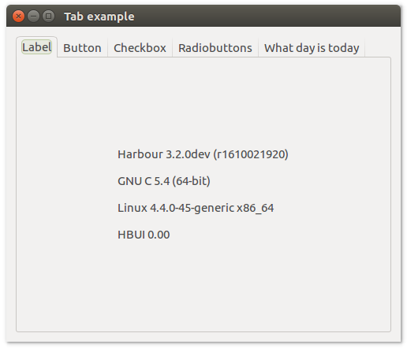

# **uiTab**

## Description

## Functions
- [uiNewTab()](#uinewtab)
- [uiTabAppend( uiTab, name, uiControl )](#uitabappend-uitab-name-uicontrol)
- [uiTabDelete( uiTab, index )](#uitabdelete-uitab-index)
- [uiTabInsertAt( uiTab, name, before, uiControl )](#uitabinsertat-uitab-name-before-uicontrol)
- [uiTabMargined( uiTab, page )](#uitabmargined-uitab-page)
- [uiTabNumPages( uiTab )](#uitabnumpages-uitab)
- [uiTabSetMargined( uiTab, page, margined )](#uitabsetmargined-uitab-page-margined)

## uiNewTab()
Arguments

Return value

Description

Simple example
```harbour
oTab := uiNewTab()
```
## uiTabAppend (uiTab, name, uiControl)
Arguments
- uiTab
- name
- uiControl

Return value

Description

Simple example
```harbour
uiTabAppend( oTab, "Page 1", uiControl( page1 ) )
```
## uiTabDelete (uiTab, index)
Arguments
- uiTab
- index

Return value

Description

Simple example
```harbour
uiTabDelete( oTab, 0 )
```
## uiTabInsertAt (uiTab, name, before, uiControl)
Arguments
- uiTab
- name
- before
- uiControl

Return value

Description

Simple example
```harbour
uiTabInsertAt( oTab, "Page 1", 0, uiControl( page1 ) )
```
## uiTabMargined (uiTab, page)
Arguments
- uiTab
- page

Return value

Description

Simple example
```harbour
uiTabMargined( oTab, page )
```
## uiTabNumPages (uiTab)
Arguments
- uiTab

Return value

Description

Simple example
```harbour
uiTabNumPages( oTab )
```
## uiTabSetMargined (uiTab, page, margined)
Arguments
- uiTab
- page
- margined

Return value

Description

Simple example
```harbour
uiTabSetMargined( oTab, page, margined )
```
## Sample source code
Example use function:
- [hb_eol()](http://harbour.edu.pl/harbour/harbour.html#hb_eol)
- [CDOW()](http://harbour.edu.pl/clipper/en/C53G01C/ng19116.html)
- [DATE()](http://harbour.edu.pl/clipper/en/C53G01C/ng1baff.html)
```harbour
#include "hbui.ch"

FUNCTION Main()
  LOCAL error
  LOCAL oWindow
  LOCAL oTab

  IF ! HB_ISNULL( error := uiInit() )
    Alert( "Failed to initializa libui... " + error )
    RETURN NIL
  ENDIF

  oWindow := uiNewWindow( "Tab example", 300, 300, .T. )
  uiWindowSetMargined( oWindow, 1 )

  oTab := uiNewTab()

  uiTabAppend( oTab, "Label", Label() )
  uiTabSetMargined( oTab, 0, 1 )

  uiTabAppend( oTab, "Button", Button() )
  uiTabSetMargined( oTab, 1, 1 )

  uiTabAppend( oTab, "Checkbox", Checkbox() )
  uiTabSetMargined( oTab, 2, 1 )

  uiTabAppend( oTab, "Radiobuttons", Radiobuttons() )
  uiTabSetMargined( oTab, 3, 1 )

  uiTabAppend( oTab, "What day is today", WhatDayIsToday() )
  uiTabSetMargined( oTab, 4, 1 )

  uiWindowSetChild( oWindow, oTab )
  uiControlShow( oWindow )

  uiMain()
  uiUninit()

RETURN NIL

FUNCTION Label()
  LOCAL oLabel
  LOCAL oGrid

  oLabel := uiNewLabel( Version()     + hb_eol() + ;
                                        hb_eol() + ;
                        hb_Compiler() + hb_eol() + ;
                                        hb_eol() + ;
                        OS()          + hb_eol() + ;
                                        hb_eol() + ;
                        "HBUI 0.00"  )

  oGrid := uiNewGrid()
  uiGridSetPadded( oGrid, 1 )
  uiGridAppend( oGrid, oLabel, 0, 0, 1, 1, 1, uiAlignCenter, 1, uiAlignCenter )

RETURN oGrid

FUNCTION Button()
  LOCAL oButton
  LOCAL oGrid

  oButton := uiNewButton( "Open" )

  oGrid := uiNewGrid()
  uiGridSetPadded( oGrid, 1 )
  uiGridAppend( oGrid, oButton, 0, 0, 1, 1, 1, uiAlignCenter, 1, uiAlignCenter )

RETURN oGrid

FUNCTION Checkbox()
  LOCAL oCheckbox
  LOCAL oGrid

  oCheckbox := uiNewCheckbox( "GitHub" )
  uiCheckboxSetChecked( oCheckbox, 1 )

  oGrid := uiNewGrid()
  uiGridSetPadded( oGrid, 1 )
  uiGridAppend( oGrid, oCheckbox, 0, 0, 1, 1, 1, uiAlignCenter, 1, uiAlignCenter)

RETURN oGrid

FUNCTION Radiobuttons()
  LOCAL oRadiobuttons
  LOCAL oGrid

  oRadiobuttons := uiNewRadioButtons()
  uiRadioButtonsAppend( oRadiobuttons, "Choose me 1" )
  uiRadioButtonsAppend( oRadiobuttons, "Choose me 2" )
  uiRadioButtonsAppend( oRadiobuttons, "Choose me 3" )

  oGrid := uiNewGrid()
  uiGridSetPadded( oGrid, 1 )
  uiGridAppend( oGrid, oRadiobuttons, 0, 0, 1, 1, 1, uiAlignCenter, 1, uiAlignCenter )

RETURN oGrid

FUNCTION WhatDayIsToday()
  LOCAL oLabel
  LOCAL oGrid

  oLabel := uiNewLabel( "Today is " + CDOW( DATE() ) )

  oGrid := uiNewGrid()
  uiGridSetPadded( oGrid, 1 )
  uiGridAppend( oGrid, oLabel, 0, 0, 1, 1, 1, uiAlignCenter, 1, uiAlignCenter )

RETURN oGrid
```

