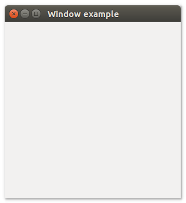

# **uiWindow**


## Description
Provides the ability to create, configure, show, and manage the lifetime of windows and dialog boxes.

## Functions
- [uiNewWindow( title, width, height, hasMenubar )](#uinewwindow-title-width-height-hasmenubar)
- [uiWindowBorderless( uiWindow )](#uiwindowborderless-uiwindow)
- [uiWindowCenter( uiWindow )](#uiwindowcenter-uiwindow)
- [uiWindowContentSize( uiWindow, width, height )](#uiwindowcontentsize-uiwindow-width-height)
- [uiWindowFullscreen( uiWindow )](#uiwindowfullscreen-uiwindow)
- [uiWindowMargined( uiWindow )](#uiwindowmargined-uiwindow)
- [uiWindowOnClosing( uiWindow, onClosing, data )](#uiwindowonclosing-uiwindow-onclosing-data)
- [uiWindowOnContentSizeChanged( onShouldQuit, uiWindow )](#uiwindowoncontentsizechanged-onshouldquit-uiwindow)
- [uiWindowOnPositionChanged( uiWindow, onMove, data )](#uiwindowonpositionchanged-uiwindow-onmove-data)
- [uiWindowPosition( uiWindow, x, y )](#uiwindowposition-uiwindow-x-y)
- [uiWindowSetBorderless( uiWindow, borderless )](#uiwindowsetborderless-uiwindow-borderless)
- [uiWindowSetChild( uiWindow, uiControl )](#uiwindowsetchild-uiwindow-uicontrol)
- [uiWindowSetContentSize( uiWindow, width, height )](#uiwindowsetcontentsize-uiwindow-width-height)
- [uiWindowSetFullscreen( uiWindow, fullscreen )](#uiwindowsetfullscreen-uiwindow-fullscreen)
- [uiWindowSetMargined( uiWindow, margined )](#uiwindowsetmargined-uiwindow-margined)
- [uiWindowSetPosition( uiWindow, x, y )](#uiwindowsetposition-uiwindow-x-y)
- [uiWindowSetTitle( uiWindow, title )](#uiwindowsettitle-uiwindow-title)
- [uiWindowTitle( uiWindow )](#uiwindowtitle-uiwindow)

<br>

- [uiMsgBox( uiWindow, title description )](#uimsgbox-uiwindow-title-description)
- [uiMsgBoxError( uiWindow, title, description )](#uimsgboxerror-uiwindow-title-description)
- [uiOpenFile( uiWindow )](#uiopenfile-uiwindow)
- [uiSaveFile( uiWindow )](#uisavefile-uiwindow)


## uiNewWindow (title, width, height, hasMenubar)
Arguments
- title - sets a window's title.
- width - sets the width of the application window in pixels.
- height - sets the height of the application window in pixels.
- hasMenubar - is an logical value that specifies whether a window has a menu bar .T. or .F.

Return value

Description

Simple example
```harbour
oWindow := uiNewWindow( "Hello Harbour!", 800, 600, .T. )
```
## uiWindowBorderless (uiWindow)
Arguments
- uiWindow

Return value

Description

Simple example
```harbour
uiWindowBorderless( oWindow )
```
## uiWindowCenter (uiWindow)
Arguments
- uiWindow

Return value

Description

Simple example
```harbour
uiWindowCenter( oWindow )
```
## uiWindowContentSize (uiWindow, width, height)
Arguments
- uiWindow
- width
- height

Return value

Description

Simple example
```harbour
uiWindowContentSize( oWindow, 800, 600 )
```
## uiWindowFullscreen (uiWindow)
Arguments
- uiWindow

Return value

Description

Simple example
```harbour
uiWindowFullscreen( oWindow )
```
## uiWindowMargined (uiWindow)
Arguments
- uiWindow

Return value

Description

Simple example
```harbour
uiWindowMargined( oWindow )
```
## uiWindowOnClosing (uiWindow, onClosing, data)
Arguments
- uiWindow
- onClosing
- data

Return value

Description

Simple example
```harbour
uiWindowOnClosing( oWindow, onClosing, NIL )
```
## uiWindowOnContentSizeChanged (onShouldQuit, uiWindow)
Arguments
- onShouldQuit
- uiWindow

Return value

Description

Simple example
```harbour
uiWindowOnContentSizeChanged( onShouldQuit, oWindow )
```
## uiWindowOnPositionChanged (uiWindow, onMove, data)
Arguments
- uiWindow
- onMove
- data

Return value

Description

Simple example
```harbour
uiWindowOnPositionChanged( oWindow, onMove, NIL )
```
## uiWindowPosition (uiWindow, x, y)
Arguments
- uiWindow
- x
- y

Return value

Description

Simple example
```harbour
uiWindowPosition( oWindow, 50, 50 )
```
## uiWindowSetBorderless (uiWindow, borderless)
Arguments
- uiWindow
- borderless

Return value

Description

Simple example
```harbour
uiWindowSetBorderless( oWindow, uiCheckboxChecked( oCheckbox ) )
```
## uiWindowSetChild (uiWindow, uiControl)
Arguments
- uiWindow
- uiControl

Return value

Description

Simple example
```harbour
uiWindowSetChild( oWindow, uiControl( oButton ) )
```
## uiWindowSetContentSize (uiWindow, width, height)
Arguments
- uiWindow
- width
- height

Return value

Description

Simple example
```harbour
uiWindowSetContentSize( oWindow, 800, 600 )
```
## uiWindowSetFullscreen (uiWindow, fullscreen)
Arguments
- uiWindow
- fullscreen

Return value

Description

Simple example
```harbour
uiWindowSetFullscreen( oWindow, uiCheckboxChecked( fullscreen ) )
```
## uiWindowSetMargined (uiWindow, margined)
Arguments
- uiWindow
- margined

Return value

Description

Simple example
```harbour
uiWindowSetMargined( oWindow, .T. )
```
## uiWindowSetPosition (uiWindow, x, y)
Arguments
- uiWindow
- x
- y

Return value

Description

Simple example
```harbour
uiWindowSetPosition( oWindow, 50, 50 )
```
## uiWindowSetTitle (uiWindow, title)
Arguments
- uiWindow
- title

Return value

Description

Simple example
```harbour
uiWindowSetTitle( oWindow, "Hello world!" )
```
## uiWindowTitle (uiWindow)
Arguments
- uiWindow

Return value

Description

Simple example
```harbour
uiWindowTitle( oWindow )
```

<br>

## uiMsgBox (uiWindow, title description)
Arguments

Return value

Description

Simple example
```harbour

```
## uiMsgBoxError (uiWindow, title, description)
Arguments

Return value

Description

Simple example
```harbour

```
## uiOpenFile (uiWindow)
Arguments

Return value

Description

Simple example
```harbour

```
## uiSaveFile (uiWindow)
Arguments

Return value

Description

Simple example
```harbour

```
## Sample source code
```harbour
FUNCTION Main()
  LOCAL error
  LOCAL oWindow

  IF ! HB_ISNULL( error := uiInit() )
    Alert( "Failed to initialize libui... " + error )
    RETURN NIL
  ENDIF

  oWindow := uiNewWindow( "Window example", 300, 300, .T. )
  uiWindowSetMargined( oWindow, 1 )

  uiControlShow( oWindow )

  uiMain()
  uiUninit()

RETURN NIL
```

